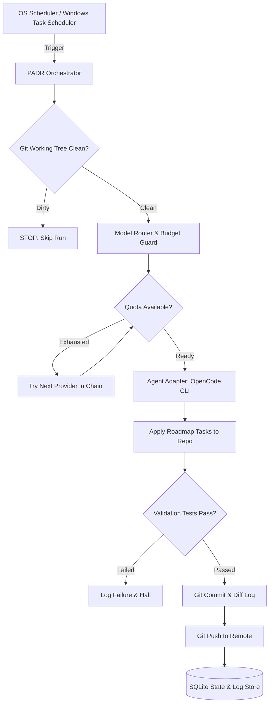

# PADR — Personal Autonomous Development Runner

[](https://golang.org)
[](LICENSE)
[]()

> **PADR** adalah personal development worker yang berjalan lokal di laptop/mesin Anda untuk menjalankan autonomous coding tasks secara terjadwal menggunakan AI coding agent CLI (OpenCode), dilengkapi dynamic model/provider fallback, Git safety guards, dan OS scheduling.

---

## 🚀 Core Features

- 🔄 **Autonomous Execution Pipeline**: Mengotomasi alur `git status clean check` ➔ `git pull --ff-only` ➔ `model resolution` ➔ `agent execution (OpenCode)` ➔ `validation test commands` ➔ `git diff review` ➔ `git commit` ➔ `git push`.
- 🛡️ **Git Safety First**: Memastikan *dirty working tree* **tidak pernah disentuh**. Jika ada uncommitted changes manual dari user, PADR otomatis membatalkan run dengan status `skipped`.
- 🔀 **Model Swapping & Fallback Chain**: Rantai fallback cerdas (`Groq` ➔ `Gemini` ➔ `OpenRouter` ➔ `Ollama local`). Jika kuota/rate limit habis pada provider utama, otomatis berpindah ke model alternatif berikutnya tanpa auto-charge.
- 💰 **Budget Guard**: Mencegah autonomous agent berjalan liar dengan membatasi runtime maksimal, kuota harian run global, dan batas run per provider.
- 🕒 **OS Task Scheduler Integration**: Integrasi native dengan Windows Task Scheduler (`schtasks`) untuk eksekusi terjadwal di latar belakang tanpa daemon berat yang memakan RAM.
- ⚡ **Pure Golang & Single Binary**: Cepat, ringan, CGO-free SQLite (`modernc.org/sqlite`), tanpa ketergantungan runtime Python.

---

## 🏛️ Architecture



---

## 📦 Installation & Build

```bash
# Clone the repository
git clone https://github.com/padr-runner/padr.git
cd padr

# Build the single standalone binary
go build -o bin/padr.exe ./cmd/padr

# Optional: Tambahkan direktori bin ke sistem PATH Anda
```

---

## ⚡ Quick Start

### 1. Inisialisasi PADR
Inisialisasi direktori kerja `~/.padr` (config, logs, state SQLite):
```bash
padr init
```

### 2. Konfigurasi Provider / API Keys
Set API key Anda di environment variable (atau gunakan `padr provider add`):
```bash
# Contoh di PowerShell
$env:GROQ_API_KEY="gsk_..."
$env:GEMINI_API_KEY="AIza..."
$env:OPENROUTER_API_KEY="sk-or-..."
```

Cek kesiapan provider dan urutan fallback:
```bash
padr models
padr quota
```

### 3. Daftarkan Repository Project
Daftarkan repository yang ingin dikembangkan secara otomatis:
```bash
padr project add food-erp --path "C:/dev/food-erp" --branch main --cron "0 9 * * *"
```
Perintah ini akan membuat file `.padr/project.yaml` di root repository tersebut.

### 4. Jalankan Autonomous Run
Jalankan run untuk satu project atau seluruh project:
```bash
# Test run dengan mock engine (dry-run aman)
padr run food-erp --dry-run

# Jalankan dengan OpenCode agent
padr run food-erp

# Jalankan untuk semua project terdaftar
padr run --all
```

---

## 📋 Project Configuration (`.padr/project.yaml`)

Setiap repository memiliki konfigurasi terisolasi:

```yaml
name: food-erp

repository:
  path: C:/dev/food-erp
  branch: main

agent:
  engine: opencode
  cli_path: opencode

development:
  roadmap: PADR_ROADMAP.md
  max_tasks: 2
  rules_file: PROJECT.md
  architecture_file: ARCHITECTURE.md

git:
  auto_pull: true
  auto_commit: true
  auto_push: true
  commit_prefix: "chore(padr):"

validation:
  commands:
    - go test ./...

schedule:
  daily_at: "09:00"
  cron: "0 9 * * *"
```

---

## ⚙️ Global Configuration (`~/.padr/config/config.yaml`)

```yaml
limits:
  max_runs_per_day: 5
  max_runtime_minutes: 45
  max_tasks_per_run: 2
  max_commits_per_run: 5

providers:
  groq-fast:
    id: groq-fast
    provider: groq
    model: openai/gpt-oss-120b
    api_key_env: GROQ_API_KEY
    max_daily_runs: 3
    enabled: true

  gemini-fast:
    id: gemini-fast
    provider: google
    model: gemini-2.5-flash
    api_key_env: GEMINI_API_KEY
    max_daily_runs: 3
    enabled: true

  openrouter-free:
    id: openrouter-free
    provider: openrouter
    model: meta-llama/llama-3.3-70b-instruct:free
    api_key_env: OPENROUTER_API_KEY
    max_daily_runs: 2
    enabled: true

  ollama-local:
    id: ollama-local
    provider: ollama
    model: qwen2.5-coder:7b
    endpoint: http://localhost:11434
    max_daily_runs: 10
    enabled: true

routing:
  strategy: fallback
  models:
    - groq-fast
    - gemini-fast
    - openrouter-free
    - ollama-local
```

---

## 💻 CLI Command Reference

| Command | Deskripsi |
|---|---|
| `padr gui` (atau `padr tray`) | Buka Dashboard Desktop Native & System Tray Manager (Fyne Dark Mode) |
| `padr init` | Inisialisasi home directory PADR (`~/.padr`) dan database SQLite |
| `padr project add <name>` | Daftarkan repository project untuk autonomous development |
| `padr project list` | Tampilkan daftar semua project yang terdaftar |
| `padr run <project>` | Jalankan autonomous development cycle untuk project |
| `padr run --all` | Jalankan autonomous cycle untuk semua project secara berurutan |
| `padr run <project> --dry-run` | Simulasi eksekusi tanpa mengubah remote repository |
| `padr status` | Tampilkan status daemon, project terdaftar, dan penggunaan kuota harian |
| `padr logs [--project <name>]` | Tampilkan tabel riwayat eksekusi (status, durasi, commit, task) |
| `padr models` | Tampilkan model yang terkonfigurasi dan urutan prioritas fallback |
| `padr quota` | Cek sisa kuota harian per provider |
| `padr provider add <id>` | Konfigurasi atau perbarui kredensial & limit provider AI |
| `padr schedule install <proj>` | Daftarkan task ke Windows Task Scheduler |
| `padr schedule list` | Tampilkan daftar scheduled task PADR yang aktif di OS |
| `padr schedule remove <proj>` | Hapus task dari Windows Task Scheduler |

---

## 🧪 Testing

Jalankan seluruh unit test suite:
```bash
go test -v ./...
```
Semua modul mencakup test otomatis untuk git safety checks, configuration validation, model router fallback, SQLite operations, dan orchestrator pipeline.
